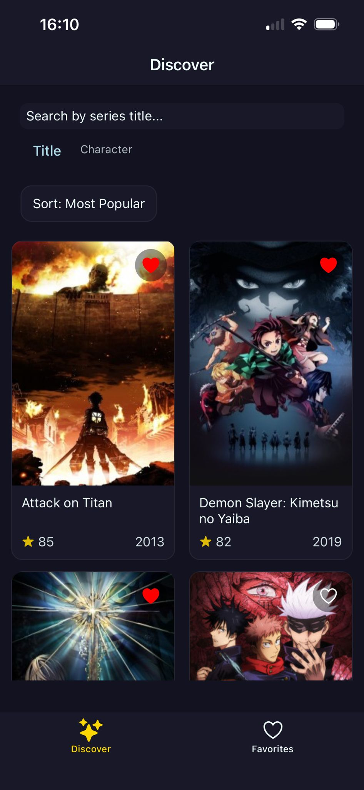
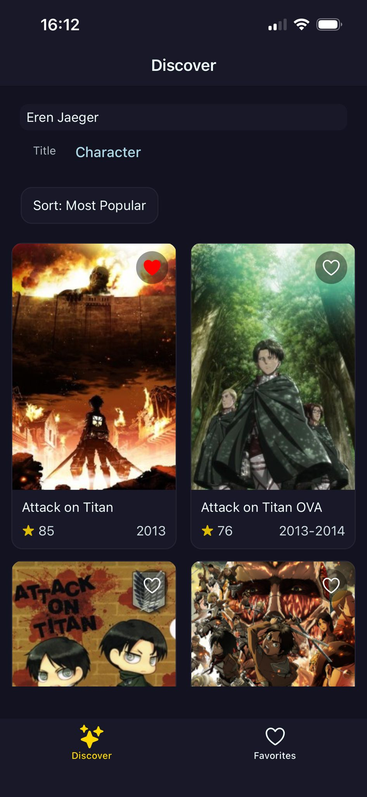
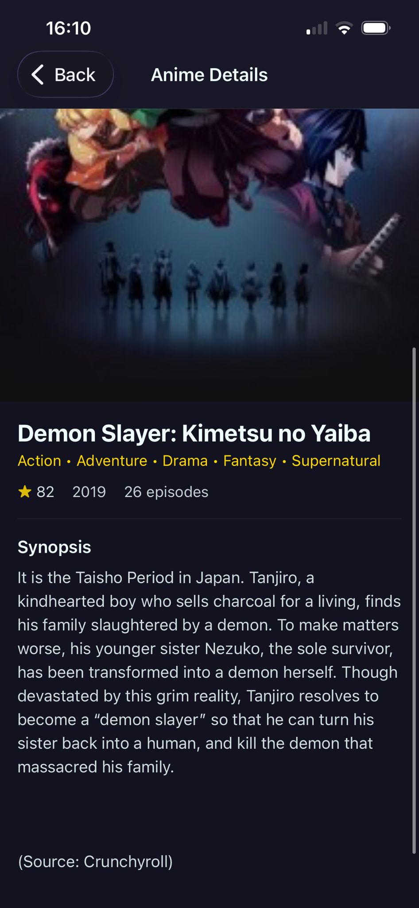
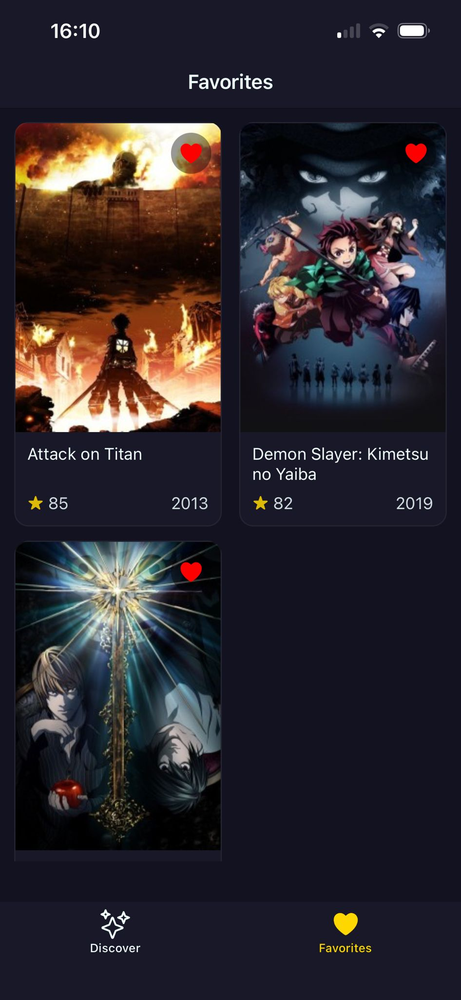

# Anime Explorer

A React Native mobile app for discovering and exploring anime. Built with Expo and Expo Router.

## Features

- **Discover** - Browse anime with sorting options (trending, popular, top rated, newest, alphabetical)
- **Search** - Search by anime title or character name
- **Details** - View detailed information about each anime
- **Favorites** - Save your favorite anime locally with AsyncStorage persistence

## Tech Stack

- **React Native** + **Expo** - Cross-platform mobile development
- **Expo Router** - File-based navigation
- **React Query** - Data fetching, caching, and pagination
- **AniList API** - Anime data provider (with swappable provider architecture)
- **AsyncStorage** - Local persistence for favorites

## Architecture

```
app/                    # Expo Router - routing only
src/
├── screens/            # Screen components with logic
├── components/         # Reusable UI components
├── context/            # React Context providers
├── hooks/              # Custom React hooks
├── models/             # Data models with validation
├── services/           # API clients and providers
├── constants/          # App constants
├── theme/              # Colors and styling
└── utils/              # Utility functions
```

**Key patterns:**
- Provider pattern for API abstraction (easily swap between Jikan/AniList)
- Context for global state (favorites)
- Custom hooks for data fetching logic
- Factory functions for data model validation
- Separated styles for each component

## Getting Started

### Prerequisites

- Node.js (LTS)
- Expo Go app on your device (for testing)

### Installation

```bash
npm install
npx expo start
```

Scan the QR code with Expo Go (Android) or Camera app (iOS).

## Screenshots

| Discover | Search | Details | Favorites |
|----------|--------|---------|-----------|
|  |  |  |  |


